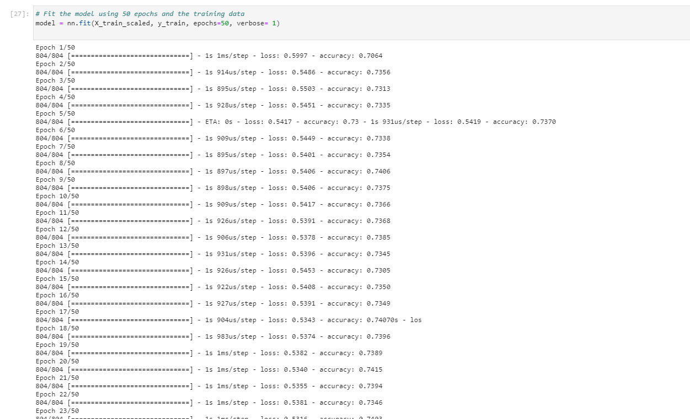
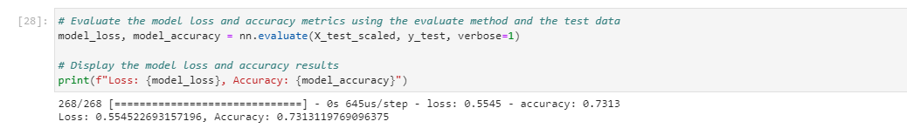
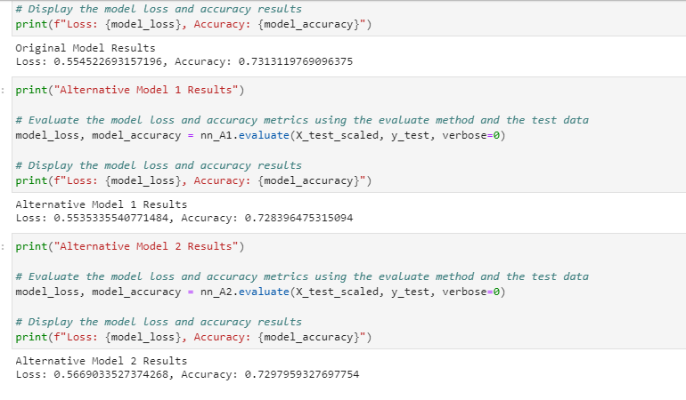

# Neural_Network_Model_funding_Analyze-
Venture capital firm receives many funding applications from startups every day. On this project we are creating a neural model to analyze and predict predicts whether applicants will be successful if funded by Venture capital firm. We took the historical data which has 34,000 organizations that have received funding from venture firm , Alphabet Soup over the years. The sata  contains a variety of information about each business, including whether or not it ultimately became successful. With the use of machine learning and neural networks, we used the features in the provided dataset to create a binary classifier model that will predict whether an applicant will become a successful business.

## Technologies

This project leverages python 3.7 with the following packages:

* [Pandas](https://pandas.pydata.org/) - For data cleaning, preparation and manipulation

* [Jupyter Notebook](https://jupyter.org/) - An open-source web application that allows you to create and share documents that contain live code, equations, visualizations and narrative text.

* [Visual Studio Code](https://code.visualstudio.com/) - A code editor redefined and optimized for building and debugging modern web and cloud applications

## Installation Guide

Download Anaconda for your operating system and the latest Python version, run the installer, and follow the steps.

Before running the application first install the following dependencies.

```python
import pandas as pd
from pathlib import Path
import tensorflow as tf
from tensorflow.keras.layers import Dense
from tensorflow.keras.models import Sequential
from sklearn.model_selection import train_test_split
from sklearn.preprocessing import StandardScaler,OneHotEncoder
```

To install PyViz and its dependencies in your Conda dev environment, complete the following steps:

1. From your terminal, log in to your Conda dev environment.
.
2. Install the PyViz packages by using the conda install command as follows:
    
	conda install -c plotly plotly=4.13.
    
    conda install -c pyviz hvplot
-----------------------------------------------------------------------------------------------------------------------------------------------------

## Usage

After finishing our models, following are the accuracy scores achieved by each model and corresponding results.

This is the snapshot after running our initial model at epoch = 50


------------------------------------------------------------------------------------------------------------------------------------

This is the 2nd snapshot after running our model with alternative parameteres by increasing the number of hidden layers from 3 to 4.


--------------------------------------------------------------------------------------------------------------------------------------

Here is the comparision between all three models. 1st model - 3 hidden layers with activation function is 'relu' and output function is sigmoid. 2nd model - 4 hidden layers with activation function is 'relu' and output function is sigmoid. 3rd model - 1 hidden layer with activation function is 'relu' and output function is sigmoid.

Since the output data is binary so 'sigmoid' is the better function. Mostly ' relu' function is considered good for hidden layers for these kinds.




----------------------------------------------------------------------------------------------------------------------------------------------------


